# Полный аудит и стратегия уникализации публичных страниц (Главная, Услуги, О компании)
**Проект:** ЖАН Finance (`JF-1C`)  
**Дата аудита:** Сентябрь 2026 г.  
**Стек:** Vite 6 / Rolldown, React, TypeScript, Tailwind CSS, Framer Motion, i18next

---

## 1. Введение и общие данные проекта

* **Компания:** ТОО «ЖАН FINANCE» (г. Алматы, пр. Достык, 180, БИН: 240140023819).
* **Позиционирование:** Инженерный подход к бухгалтерскому учету («Машинная точность и финансовая инженерия»), разделение труда в учетном процессе, юридическая материальная ответственность за штрафы и пени, соблюдение стандартов МСФО.
* **Локация исходного кода:** `C:\Users\murat\IdeaProjects\JF-1C\zhan-finance-frontend\`.
* **Хостинг:** GitHub Pages (`https://mrsgemaseny.github.io/JF-1C/`).

---

## 2. Архитектурный и технический аудит

### 2.1. Структура сборки и бандлов
Проект собран с разделением на ролевые модули:
1. `chunk-public` — публичные страницы (Главная, Услуги, О компании, авторизация, правовые документы).
2. `chunk-client` — кабинет клиента (обмен документами, электронная подпись, календарь отчетности, чат).
3. `chunk-employee` — кабинет сотрудника (пул задач, клиенты, обработка документов).
4. `chunk-admin` — админ-панель (CRM воронка сделок, управление правами, редактор LMS-курсов).
5. `chunk-learner` — обучающая платформа LMS (прохождение уроков, тесты, выдача сертификатов).

### 2.2. Причина ошибки 404 при прямых переходах на `/services` и `/about`
* **Проблема:** При прямом переходе по URL `https://mrsgemaseny.github.io/JF-1C/services` GitHub Pages возвращает `404 Not Found`.
* **Причина:** На GitHub Pages отсутствует серверный URL-rewrite для SPA. В проекте используется хак `spa-github-pages`, но в репозитории файл `404.html` содержит скрипт восстановления URL (из `index.html`) вместо скрипта перенаправления.
* **Решение:** В `404.html` должен быть скрипт редиректа вида:
  ```html
  <script type="text/javascript">
    var pathSegmentsToKeep = 1;
    var l = window.location;
    l.replace(
      l.protocol + '//' + l.hostname + (l.port ? ':' + l.port : '') +
      l.pathname.split('/').slice(0, 1 + pathSegmentsToKeep).join('/') + '/?/' +
      l.pathname.slice(1).split('/').slice(pathSegmentsToKeep).join('/').replace(/&/g, '~and~') +
      (l.search ? '&' + l.search.slice(1).replace(/&/g, '~and~') : '') +
      l.hash
    );
  </script>
  ```

---

## 3. Детальный аудит исходного кода страниц

```
src/pages/
├── home/
│   ├── HomePage.tsx              → Сборка главной страницы из 11 секций
│   └── sections/
│       ├── WhyOutsource.tsx      → 4 карточки преимуществ + список из 6 входящих услуг
│       ├── HomeAbout.tsx         → Полароид-галерея фото с наклоном + переход на /about
│       ├── HomeAdvantages.tsx    → Блоки 01-04 (Преимущества компании)
│       └── HomeServices.tsx      → Двухколоночный каталог (Разовые / Аутсорс) с модалкой
├── services/
│   ├── ServicesPage.tsx          → Сборка страницы услуг
│   └── sections/
│       ├── ServicesHero.tsx      → Заголовок и вводный текст
│       ├── ServicesCatalog.tsx   → [ДУБЛИКАТ] Точная копия HomeServices.tsx
│       └── ServicesFaqContact.tsx→ Блок FAQ и контакты
└── about/
    ├── AboutPage.tsx             → Сборка страницы о компании
    └── sections/
        ├── AboutHero.tsx         → «Машинная точность и финансовая инженерия»
        ├── AboutStats.tsx        → Факты и цифры (4 плашки)
        ├── AboutIdeology.tsx     → Текст про хаос штатной бухгалтерии и MDM
        ├── AboutProcess.tsx      → Инженерный процесс из workProcess
        └── AboutGuarantees.tsx   → Гарантии (NDA, компенсация штрафов, непрерывность)
```

### Выявленные проблемы и антипаттерны:
1. **Дублирование каталога услуг:** `ServicesCatalog.tsx` и `HomeServices.tsx` на 100% совпадают по структуре, логике разделения `isOneTime` и даже ключам локализации `homeServices.title`.
2. **Дублирование блока тарифов:** Виджет `PricingTable` выводится одновременно и на Главной, и на странице Услуг в абсолютно одинаковом виде.
3. **Битая якорная ссылка:** В `Hero.tsx` кнопка CTA ссылается на `href="#solution-picker"`, но элемента с таким `id` на Главной странице нет.
4. **Недостаток инфографики в «О компании»:** Сильный текст про разделение труда и Master Data Management подан сплошным текстом без наглядной схемы конвейера.
5. **Отсутствие команды в «О компании»:** Виджет `Team` (лица экспертов) выведен на Главной, но отсутствует на странице `AboutPage`, где он критически необходим.

---

## 4. Стратегия уникализации страниц

Каждая страница должна закрывать свой этап пользовательского пути:

```mermaid
flowchart TD
    subgraph P1["1. ГЛАВНАЯ СТРАНИЦА (/)"]
        direction TB
        H_Intent["Интент: «Кто вы и решите ли вы мою проблему?»"]
        H_Tool1["Интерактивный экспресс-калькулятор тарифа"]
        H_Tool2["Сравнение: Штат vs Фриланс vs ЖАН Finance"]
        H_Tool3["Тизер 3 ключевых направлений + переход в каталог"]
    end

    subgraph P2["2. СТРАНИЦА УСЛУГ (/services)"]
        direction TB
        S_Intent["Интент: «Что входит в тариф и каков регламент SLA?»"]
        S_Tool1["Табы по отраслям (E-com, ВЭД/Импорт, IT/Astana Hub, Услуги)"]
        S_Tool2["Матрица регламентов SLA (сроки ЭСФ, закрытия месяца)"]
        S_Tool3["Чек-лист: Что входит / Что не входит в абонплату"]
        S_Tool4["Экспресс-пакеты (Аудит 1С, Разблокировка счетов)"]
    end

    subgraph P3["3. О КОМПАНИИ (/about)"]
        direction TB
        A_Intent["Интент: «Кому я доверяю данные и чем вы гарантируете?»"]
        A_Tool1["Инфографика конвейера (Оператор → Расчетчик → Методолог)"]
        A_Tool2["Протоколы безопасности данных (бэкапы, 2FA, NDA)"]
        A_Tool3["Виджет команды и профессиональные сертификаты"]
        A_Tool4["Скан/пункт договора о 100% компенсации штрафов"]
    end
```



---

## 5. Сводная матрица различий

| Параметр | Главная (`/`) | Услуги (`/services`) | О компании (`/about`) |
| :--- | :--- | :--- | :--- |
| **Главная цель** | Захват лида и быстрая навигация | Детализация состава работ и тарифов | Формирование фундаментального доверия |
| **Целевая аудитория** | Все входящие посетители | Те, кто сравнивает условия и цены | Те, кто принимает решение о подписании договора |
| **Ключевой интерактив** | Экспресс-калькулятор стоимости | Конфигуратор тарифа по отраслям бизнеса | Схема конвейера обработки первички |
| **Формат каталога** | Краткий тизер (3 карточки) | Развернутый каталог с поиском и фильтрами | Нет (ссылка на услуги) |
| **Фокус цен** | Вилка ориентировочной цены | Точная матрица стоимости и SLA | Обоснование прозрачности ценообразования |
| **Блок команды** | Краткий блок основателей | — | Полный виджет команды с сертификатами |

---

## 6. Пошаговый план внедрения изменений в код

### Шаг 1. Рефакторинг Главной страницы (`src/pages/home/`)
* [ ] В `Hero.tsx` исправить якорную ссылку или добавить секцию с `id="solution-picker"`.
* [ ] Заменить `HomeServices.tsx` на компактный тизер: 3 карточки («Аутсорсинг ТОО/ИП», «Восстановление учета», «1С-Автоматизация») с кнопкой «Все услуги (15+) $\rightarrow$».
* [ ] В секции `WhyOutsource.tsx` сфокусироваться на сравнении трех моделей: Штатный бухгалтер vs Приходящий бухгалтер vs ЖАН Finance.

### Шаг 2. Рефакторинг страницы «Услуги» (`src/pages/services/`)
* [ ] Удалить дублирование кода из `ServicesCatalog.tsx`.
* [ ] Реализовать фильтрацию услуг по отраслям бизнеса (Казахстан):
  * E-commerce и маркетплейсы (Kaspi, Wildberries, Ozon);
  * ВЭД и импорт (ЕАЭС, КНР, СНТ, Виртуальный склад);
  * IT-компании (льготы Astana Hub, 0% КПН/НДС);
  * Розничная торговля и общепит (СНР розничного налога, ТИС).
* [ ] Добавить прозрачную таблицу: «Что входит в ежемесячный тариф» vs «Дополнительные разовые услуги».

### Шаг 3. Рефакторинг страницы «О компании» (`src/pages/about/`)
* [ ] Перенести компонент `<Team />` из `HomePage.tsx` в `AboutPage.tsx`.
* [ ] Превратить текстовые описания `AboutIdeology.tsx` в визуальный интерактивный пайплайн:
  $$\text{Оператор первички} \longrightarrow \text{Расчетчик ЗП} \longrightarrow \text{Налоговый методолог} \longrightarrow \text{Финансовый архитектор}$$
* [ ] В `AboutGuarantees.tsx` оформить юридические гарантии в виде интерактивного блока с выдержками из договора SLA и кнопкой «Скачать образец договора».

### Шаг 4. Устранение 404 на GitHub Pages
* [ ] Обновить скрипт в `public/404.html` на корректный редирект для `spa-github-pages`.
