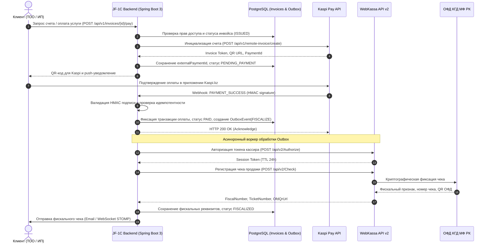

# Архитектурный план интеграции: Платежи и фискализация (Kaspi Pay API + WebKassa API)

## 1. Теоретический базис и нормативно-правовая база Республики Казахстан

### 1.1. Нормативное регулирование фискализации в РК
В соответствии со статьей 166 Налогового кодекса Республики Казахстан (НК РК):
- Все денежные расчеты при реализации товаров, работ, услуг на территории РК осуществляются с обязательным применением контрольно-кассовых машин с функцией фиксации и (или) передачи данных (ККМ с ФПД / онлайн-ККМ).
- Онлайн-ККМ обязана в реальном времени передавать сведения о денежных расчетах оператору фискальных данных (ОФД: Казахтелеком, Транстелеком или Казпочта), который регистрирует чек на серверах Комитета государственных доходов Министерства финансов РК (КГД МФ РК).
- Чек ККМ должен содержать обязательные фискальные реквизиты: ИИН/БИН налогоплательщика, заводской и регистрационный номер ККМ, фискальный признак (ФП), порядковый номер чека, дату и время, сумму, наименование товаров/услуг, признак НДС, а также QR-код для верификации чека на портале ОФД.

### 1.2. Роль сервиса WebKassa
WebKassa — сертифицированная программная онлайн-касса, включенная в Государственный реестр ККМ РК под номером 208.
- Предоставляет облачный REST API (WebKassa API v2) для программного открытия/закрытия смен, регистрации кассовых чеков (продажа, покупка, возврат продажи, возврат покупки), внесения/изъятия наличных и формирования Z/X-отчетов.
- Берет на себя поддержание непрерывного криптографического TLS-соединения с ОФД, хранение фискальных накопителей и генерацию фискальных признаков без необходимости физического кассового аппарата.

### 1.3. Специфика эквайринга и b2c/b2b платежей через Kaspi Pay
Kaspi Pay является доминирующим платежным шлюзом для малого и среднего бизнеса в Казахстане:
- **Kaspi Pay Smart POS / QR:** Оплата по QR-коду покупателем через приложение Kaspi.kz.
- **Удаленный счет (Remote Invoice / Push-счет):** Выставление электронного счета на номер телефона клиента. Клиент получает push-уведомление в мобильном приложении Kaspi.kz и подтверждает списание средств в один клик.
- **Kaspi Business B2B API:** Позволяет инициировать выставление счета, проверять статус оплаты, осуществлять возврат средств, а также получать вебхуки о входящих транзакциях.

### 1.4. Архитектурная коллизия: Оплата vs Фискализация
При безналичных платежах через Kaspi Pay банк НЕ фискализирует операцию автоматически в ОФД за продавца. Kaspi формирует только банковскую платежную квитанцию. Фискальный чек в адрес КГД МФ РК обязан выбить сам налогоплательщик.
- Несвоевременная фискализация или дублирование чеков влечет административную ответственность по ст. 284 КоАП РК (штраф от 15 до 50 МРП).
- Требуется строгий распределенный транзакционный контур с обеспечением идемпотентности: Оплата в Kaspi подтверждена -> Мгновенная фискализация в WebKassa -> Привязка фискального признака и ссылки на чек ОФД к инвойсу в JF-1C.

---

## 2. Архитектура интеграционного модуля JF-1C

### 2.1. Диаграмма последовательности (Sequence Diagram)



---

## 3. Схема базы данных (PostgreSQL / Flyway V122)

```sql
-- Таблица интеграционных настроек касс и платежных шлюзов
CREATE TABLE payment_gateways (
    id BIGSERIAL PRIMARY KEY,
    name VARCHAR(64) NOT NULL UNIQUE, -- 'KASPI_PAY', 'WEBKASSA'
    is_active BOOLEAN NOT NULL DEFAULT false,
    environment VARCHAR(16) NOT NULL DEFAULT 'PRODUCTION', -- 'SANDBOX', 'PRODUCTION'
    base_url VARCHAR(255) NOT NULL,
    credentials_encrypted TEXT NOT NULL, -- JSON c токенами, зашифрованный AES-GCM-256
    created_at TIMESTAMP WITH TIME ZONE NOT NULL DEFAULT NOW(),
    updated_at TIMESTAMP WITH TIME ZONE NOT NULL DEFAULT NOW()
);

-- Таблица онлайн-касс WebKassa
CREATE TABLE cash_registers (
    id BIGSERIAL PRIMARY KEY,
    cashbox_unique_number VARCHAR(64) NOT NULL UNIQUE, -- Номер кассы в WebKassa
    registration_number VARCHAR(64) NOT NULL, -- Рег. номер ККМ в КГД
    organization_bin VARCHAR(12) NOT NULL,
    name VARCHAR(128) NOT NULL,
    current_shift_number INT DEFAULT 0,
    shift_status VARCHAR(32) NOT NULL DEFAULT 'CLOSED', -- 'OPENED', 'CLOSED'
    shift_opened_at TIMESTAMP WITH TIME ZONE,
    is_default BOOLEAN NOT NULL DEFAULT false,
    created_at TIMESTAMP WITH TIME ZONE NOT NULL DEFAULT NOW()
);

-- Расширение таблицы инвойсов для фискализации и платежей
ALTER TABLE invoices
    ADD COLUMN external_payment_id VARCHAR(128),
    ADD COLUMN payment_method VARCHAR(32), -- 'KASPI_PAY', 'BANK_TRANSFER', 'CARD'
    ADD COLUMN payment_date TIMESTAMP WITH TIME ZONE,
    ADD COLUMN fiscal_status VARCHAR(32) NOT NULL DEFAULT 'NOT_REQUIRED', 
    -- 'NOT_REQUIRED', 'PENDING', 'FISCALIZED', 'FAILED'
    ADD COLUMN fiscal_ticket_number VARCHAR(64),
    ADD COLUMN fiscal_sign VARCHAR(64),
    ADD COLUMN ofd_check_url VARCHAR(512),
    ADD COLUMN fiscal_error TEXT;

-- Outbox-таблица для гарантированной доставки фискализации
CREATE TABLE payment_outbox (
    id BIGSERIAL PRIMARY KEY,
    aggregate_type VARCHAR(64) NOT NULL, -- 'INVOICE'
    aggregate_id BIGINT NOT NULL,
    event_type VARCHAR(64) NOT NULL, -- 'FISCALIZE_CHECK', 'CANCEL_CHECK'
    payload JSONB NOT NULL,
    status VARCHAR(32) NOT NULL DEFAULT 'PENDING', -- 'PENDING', 'PROCESSING', 'COMPLETED', 'FAILED'
    retry_count INT NOT NULL DEFAULT 0,
    max_retries INT NOT NULL DEFAULT 5,
    last_error TEXT,
    next_retry_at TIMESTAMP WITH TIME ZONE NOT NULL DEFAULT NOW(),
    created_at TIMESTAMP WITH TIME ZONE NOT NULL DEFAULT NOW(),
    updated_at TIMESTAMP WITH TIME ZONE NOT NULL DEFAULT NOW()
);

CREATE INDEX idx_payment_outbox_retry ON payment_outbox (status, next_retry_at) 
    WHERE status IN ('PENDING', 'FAILED');
CREATE INDEX idx_invoices_ext_payment ON invoices (external_payment_id);
```

---

## 4. Контракты API и реализация шлюзов

### 4.1. Спецификация Kaspi Pay B2B API

#### Запрос на создание удаленного счета (Remote Invoice)
```http
POST https://kaspi.kz/api/b2b/v1/invoices/create
Content-Type: application/json
Authorization: Bearer {KASPI_API_KEY}
X-Signature: {HMAC_SHA256_HEX}
```

```json
{
  "merchantId": "MERCHANT_910240001",
  "externalInvoiceId": "INV-2026-00491",
  "amount": 150000.00,
  "currency": "KZT",
  "comment": "Оплата за бухгалтерское сопровождение ТОО Astana Digital за август 2026 г.",
  "clientIdentifier": {
    "type": "PHONE",
    "value": "+77015551234"
  },
  "returnUrl": "https://crm.zhanfinance.kz/client/invoices/INV-2026-00491?status=success",
  "expireMinutes": 1440
}
```

#### Ответ Kaspi Pay
```json
{
  "status": "CREATED",
  "invoiceToken": "kaspi_inv_9f8d7c6b5a4e3d2c",
  "paymentUrl": "https://pay.kaspi.kz/pay?token=kaspi_inv_9f8d7c6b5a4e3d2c",
  "qrCodeData": "https://kaspi.kz/pay/qr?token=kaspi_inv_9f8d7c6b5a4e3d2c",
  "expireAt": "2026-09-10T12:00:00Z"
}
```

#### Обработка входящего Webhook от Kaspi Pay
```json
{
  "event": "PAYMENT_CONFIRMED",
  "merchantId": "MERCHANT_910240001",
  "externalInvoiceId": "INV-2026-00491",
  "kaspiPaymentId": "KP-9817294812",
  "amount": 150000.00,
  "currency": "KZT",
  "paidAt": "2026-09-09T12:05:41Z",
  "clientPhone": "+77015551234",
  "clientName": "Орынбасар М."
}
```

### 4.2. Спецификация WebKassa API v2

#### Авторизация кассы
```http
POST https://api.webkassa.kz/api/v2/Authorize
Content-Type: application/json
```
```json
{
  "Login": "zhanfinance_kassir",
  "Password": "StrongSecretPasswordHash"
}
```

#### Регистрация кассового чека (Check)
```http
POST https://api.webkassa.kz/api/v2/Check
Content-Type: application/json
X-Auth-Token: {WEBKASSA_TOKEN}
```
```json
{
  "CashboxUniqueNumber": "SWK00049182",
  "CheckType": 0,
  "Customer": {
    "Name": "ТОО Astana Digital Solutions",
    "IIN": "220940039182",
    "Email": "info@astana-digital.kz",
    "Phone": "+77015551234"
  },
  "Positions": [
    {
      "Name": "Услуги бухгалтерского учета и составления налоговой отчетности",
      "Count": 1.0,
      "Price": 150000.00,
      "TaxPercent": 0,
      "TaxType": 0,
      "UnitCode": "796"
    }
  ],
  "Payments": [
    {
      "PaymentType": 1,
      "Sum": 150000.00
    }
  ],
  "RoundType": 0,
  "ExternalCheckNumber": "INV-2026-00491"
}
```

#### Ответ WebKassa с данными ОФД
```json
{
  "Data": {
    "CheckNumber": "1049",
    "DateTime": "09.09.2026 12:05:44",
    "FiscalSign": "981273948172",
    "Cashbox": {
      "RegistrationNumber": "010100491827",
      "UniqueNumber": "SWK00049182",
      "IdentityNumber": "240140023819"
    },
    "TicketUrl": "https://consumer.oofd.kz/check/981273948172",
    "QrCode": "data:image/png;base64,iVBORw0KGgoAAAANSUhEUgAA..."
  },
  "Errors": []
}
```

---

## 5. Бэкенд-реализация на Spring Boot 3

### 5.1. Обработка Webhook с HMAC-валидацией
```java
@RestController
@RequestMapping("/api/v1/webhooks/kaspi")
@RequiredArgsConstructor
@Slf4j
public class KaspiPayWebhookController {

    private final PaymentProcessingService paymentProcessingService;
    private final KaspiSignatureVerifier signatureVerifier;

    @PostMapping(value = "/payment-notification", consumes = MediaType.APPLICATION_JSON_VALUE)
    public ResponseEntity<Void> handlePaymentNotification(
            @RequestHeader("X-Signature") String signature,
            @RequestBody String rawPayload) {
        
        if (!signatureVerifier.isValid(rawPayload, signature)) {
            log.warn("Недействительная цифровая подпись вебхука Kaspi Pay");
            return ResponseEntity.status(HttpStatus.UNAUTHORIZED).build();
        }

        KaspiWebhookDto dto = JsonUtils.parse(rawPayload, KaspiWebhookDto.class);
        paymentProcessingService.processSuccessfulPayment(dto);

        return ResponseEntity.ok().build();
    }
}
```

### 5.2. Транзакционная обработка и регистрация Outbox
```java
@Service
@RequiredArgsConstructor
@Slf4j
public class PaymentProcessingServiceImpl implements PaymentProcessingService {

    private final InvoiceRepository invoiceRepository;
    private final PaymentOutboxRepository outboxRepository;
    private final ApplicationEventPublisher eventPublisher;

    @Override
    @Transactional
    public void processSuccessfulPayment(KaspiWebhookDto dto) {
        Invoice invoice = invoiceRepository.findByInvoiceNumber(dto.getExternalInvoiceId())
                .orElseThrow(() -> new EntityNotFoundException("Инвойс не найден: " + dto.getExternalInvoiceId()));

        if (invoice.getStatus() == InvoiceStatus.PAID) {
            log.info("Инвойс {} уже оплачен ранее (идемпотентный повтор)", invoice.getInvoiceNumber());
            return;
        }

        invoice.setStatus(InvoiceStatus.PAID);
        invoice.setPaymentMethod("KASPI_PAY");
        invoice.setExternalPaymentId(dto.getKaspiPaymentId());
        invoice.setPaymentDate(dto.getPaidAt());
        invoice.setFiscalStatus(FiscalStatus.PENDING);
        invoiceRepository.save(invoice);

        FiscalizePayload payload = FiscalizePayload.builder()
                .invoiceId(invoice.getId())
                .invoiceNumber(invoice.getInvoiceNumber())
                .amount(invoice.getAmount())
                .clientBin(invoice.getClient().getBin())
                .clientEmail(invoice.getClient().getEmail())
                .description(invoice.getDescription())
                .build();

        PaymentOutbox outbox = PaymentOutbox.builder()
                .aggregateType("INVOICE")
                .aggregateId(invoice.getId())
                .eventType("FISCALIZE_CHECK")
                .payload(JsonUtils.toJsonNode(payload))
                .status(OutboxStatus.PENDING)
                .nextRetryAt(Instant.now())
                .build();
        outboxRepository.save(outbox);

        log.info("Оплата по инвойсу {} зафиксирована. Задача фискализации добавлена в Outbox", invoice.getInvoiceNumber());
    }
}
```

### 5.3. Асинхронный воркер фискализации с Exponential Backoff
```java
@Component
@RequiredArgsConstructor
@Slf4j
public class FiscalizationOutboxScheduler {

    private final PaymentOutboxRepository outboxRepository;
    private final WebKassaClient webKassaClient;
    private final InvoiceRepository invoiceRepository;

    @Scheduled(fixedDelay = 5000)
    public void processPendingFiscalizations() {
        List<PaymentOutbox> pendingTasks = outboxRepository.findTasksForProcessing(
                Instant.now(), PageRequest.of(0, 10));

        for (PaymentOutbox task : pendingTasks) {
            processTask(task);
        }
    }

    private void processTask(PaymentOutbox task) {
        try {
            task.setStatus(OutboxStatus.PROCESSING);
            outboxRepository.save(task);

            FiscalizePayload payload = JsonUtils.parse(task.getPayload(), FiscalizePayload.class);
            WebKassaCheckResponse response = webKassaClient.registerCheck(payload);

            Invoice invoice = invoiceRepository.findById(payload.getInvoiceId()).orElseThrow();
            invoice.setFiscalStatus(FiscalStatus.FISCALIZED);
            invoice.setFiscalTicketNumber(response.getData().getCheckNumber());
            invoice.setFiscalSign(response.getData().getFiscalSign());
            invoice.setOfdCheckUrl(response.getData().getTicketUrl());
            invoiceRepository.save(invoice);

            task.setStatus(OutboxStatus.COMPLETED);
            outboxRepository.save(task);
            log.info("Успешная фискализация инвойса {}, ФП: {}", invoice.getInvoiceNumber(), invoice.getFiscalSign());

        } catch (Exception ex) {
            log.error("Ошибка фискализации задачи ID: {}", task.getId(), ex);
            task.setRetryCount(task.getRetryCount() + 1);
            task.setLastError(ex.getMessage());
            
            if (task.getRetryCount() >= task.getMaxRetries()) {
                task.setStatus(OutboxStatus.FAILED);
            } else {
                task.setStatus(OutboxStatus.PENDING);
                task.setNextRetryAt(Instant.now().plusSeconds((long) Math.pow(2, task.getRetryCount()) * 10));
            }
            outboxRepository.save(task);
        }
    }
}
```

---

## 6. Клиентский интерфейс (Frontend FSD)

### 6.1. UI-компоненты
1. **Кнопка «Оплатить через Kaspi Pay»:**
   - При клике инициирует `POST /api/v1/invoices/{id}/pay/kaspi`.
   - На десктопе открывает модальное окно с динамическим QR-кодом для сканирования камерой Kaspi.
   - На мобильном устройстве делает DeepLink переход: `kaspi://pay?token={token}`.
2. **Индикатор фискализации:**
   - После подтверждения оплаты отображается бейдж «Оплачено» и зеленая метка «Фискальный чек ОФД».
   - Кнопка «Посмотреть чек в ОФД» открывает официальную страницу чека с QR-кодом налогового органа.

---

## 7. Чек-лист тестирования и ввода в эксплуатацию

1. **Тестирование в песочнице Kaspi Pay (Sandbox):**
   - Проверка генерации токена удаленного счета.
   - Эмуляция успешной оплаты с валидацией HMAC-подписи.
   - Проверка сценария отмены счета и истечения TTL (1440 минут).
2. **Тестирование WebKassa в тестовом контуре:**
   - Открытие и закрытие смены (Z-отчет).
   - Формирование чека с нулевым НДС и со стандартным НДС 12%.
   - Тестирование возврата средств и аннулирования чека.
3. **Отказоустойчивость (Resilience & Chaos Testing):**
   - Отключение серверов WebKassa на 30 минут во время пика оплат: подтверждение, что Outbox-очередь накапливает задачи и успешно досылает чеки после восстановления связи без потери фискальных данных.
